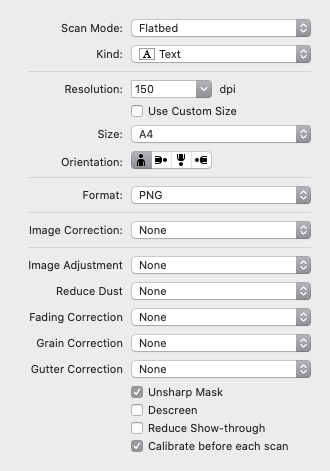
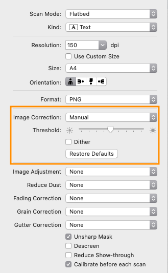
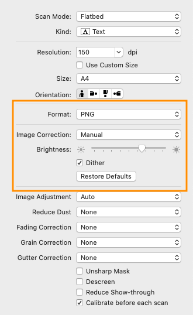

# preliminari

- definire il nome del post (e.g. _nome-del-post_)
    - convertire tutto a minuscolo
    - sostituire tutti i caratteri non alfanumerici con dei trattini

# preparazione immagini

- ogni pagina su un file png indipendente
    - usare come base il nome del post
    - aggiungere in testa la data in formato ISO (e.g. _yyyy-mm-dd-nome-del-post_)
    - aggiungere un numero di sequenza (nome-1, nome-2, nome-3, …)
- aprire https://tinypng.com/
    - caricare tutte le pagine in drag-and-drop
    - scaricare lo zip con i file compressi

# immagini digitali

- esportare in png come detto

# scansioni

## tutti i formati

- montare nello scanner su flatbed, allineando il lato superiore in fondo a sx
- effettuare la scansione con i parametri definiti sotto per ogi tipo di immagine
- prima di salvare, rifilare in modo da eliminare eventuali sporcizie al margine

## bianco e nero (e.g. china)

## monocromo

- aggiustare sulla prima pagina il livello di threshold
- procedere con lo stesso livello per le pagine successive

## mezzatinta

- selezionare l'opzione dither
- aggiustare sulla prima pagina il livello di threshold al punto più basso per cui non compaiono puntini sullo sfondo
- procedere con lo stesso livello per le pagine successive

# inserimento del post

- aprire l'interfaccia di caricamento cliccando su © a piè di pagina
- se necessario autorizare l'applicazione su github
- creare un nuovo post
    - compilare il titolo (con la maiuscola…)
    - caricare le immagini
    - selezionare la categoria
    - pubblicare

# quando il resto fallisce…

- …chiedere al personale specializzato (fra o papà)
